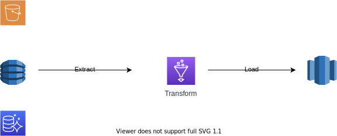
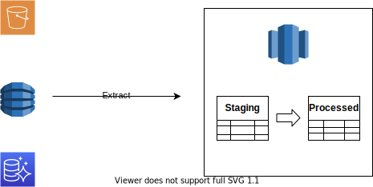
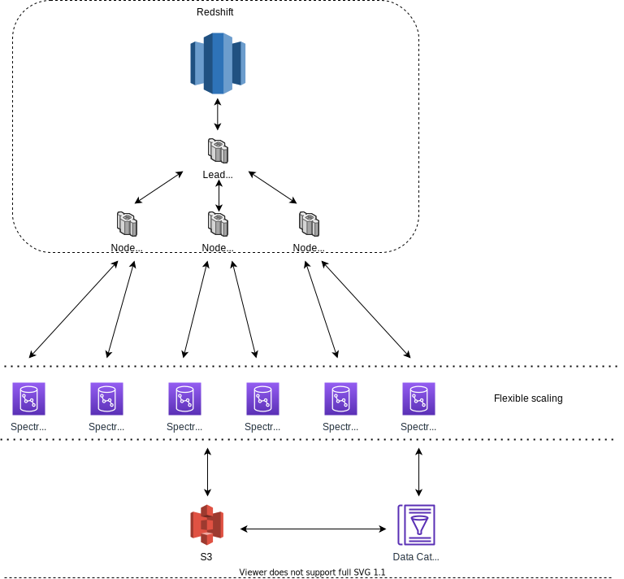

# Features of Redshift that help you scale your AWS Data Platform

The headline features of Redshift are most likely what would make an organization choose it to be part of their data platform.
Being based on Postgres SQL it has familiar SQL semantics and a transactional commit model.
This makes it relatively easy for data engineers to transition to, whilst its columnar storage and plethora of schema optimizations such sort and distribution styles allow it's column-based storage to offer excellent performance versus a traditional transactional database and row-based storage.

Since its release, however, the world has moved on and most modern data platforms will seek to decouple storage, search and schema to support a wide ecosystem of ingestion and analytical technologies.

This means that any technology choice for a modern data platform, should ideally come with out of the box optimizations around operational efficiency, scalability, performance, and security to allow the kind of ease of integration that is required when a team may support multiple technology choices as well as dealing with multiple sources and consumers of data.

## Copy command

Traditionally a data-warehouse will receive data from some kind of ETL process such as the on shown below.



Depending on business requirements as well as the quality of the data this may be required, but in a larger organization where transactional data is coming from multiple different sources this can present many logistical challenges.

The  COPY command allows you to load data into a Redshift table from an S3 bucket.  This allows the use of a staging table to somewhat invert the ingestion of data into your platform from ETL to ELT.



Where this is a feasible strategy (it is best suited when dealing with flat, unstructured data sources whose schema will change infrequently, or for situations where data is already prepared and you just want to load it into Redshift) it can reduce the development complexity of using things such as  EMR / AWS Glue Jobs / Workflows and triggers.   Whilst something still needs to trigger the copying of the data this can be much simpler than creating custom Glue Jobs in Python and trying to leverage the capabilities of PySpark.

NB: Caution must be taken when choosing this approach as it will increase a data platform's reliance on Redshift if it is used for "mission-critical" workloads which may or may not suit an organization's long-term plans.

It can also be desirable to transform data within Redshift as part of the process of creating a de-normalized dimensional model as things such as DIST keys that can be defined on tables can offer incredible performance gains when joining data together.

In environments where network traffic must not traverse the public internet to access S3, there is also an enhanced VPC routing setting for a Redshift Cluster to ensure that traffic to and from S3 is routed through a VPC endpoint.  This allows bucket policies in buckets used by Redshift, such as the one shown below, to contain conditional policies that only allow access from specific VPC Endpoints.  This level of constraint and assurance is required for any scalable and secure data strategy.

```javascript{
   "Version": "2012-10-17",
   "Id": "Policy14151159094552",
   "Statement": [
     {
       "Sid": "Access-to-specific-VPCE-only",
       "Principal": "*",
       "Action": "s3:*",
       "Effect": "Deny",
       "Resource": ["arn:aws:s3:::RS-DATA-BUCKET",
                    "arn:aws:s3:::RS-DATA-BUCKET/*"],
       "Condition": {
         "StringNotEquals": {
           "aws:SourceVpce": "vpce-1a2b3c4d"
         }
       }
     }
   ]
}
```

## Unload command

The UNLOAD command is the logical companion of the COPY command in that it allows you to take data from one table in one of your schema's and unload the selected data set into an S3 bucket or partition.

One of the things that make this feature powerful as some of the clauses that can be used in conjunction with it.

### Format As (Parquet) clause

The ability to format the unloaded data in a specific format can be useful.
Traditionally data stored in files is held in row-based formats such as CSV.
The "Format As" clause can store data in the columnar Parquet format.
Like all columnar formats, this has distinct advantages when storing data to perform analytics.
By favouring Parquet as the storage format for your data lake it can be:

- 2x faster to unload
- consumes up to 6x less storage in Amazon S3
- can offer an exponential improvement for basic queries that involve count due to the metadata stored on this in the Parquet format's footer

### Partition by clause

This clause allows data to be stored in a way that allows data to be easily retrieve in logically related set for example:

- by date (it is quite a popular approach to partition by multiple parts of a records date such as year/month/day)
- categories and sub-categories
- country / region

Partitions are also formatted using the Apache Hive convention. For example, a Parquet file that belongs to the partition, year 2019 and the month September has the following prefix: `s3://example_bucket_name/example_prefix/year=2019/month=September/000.parquet`.

When combined with an open data format such as Parquet, this can help with the long term portability and compatibility of data and its ability to be used with other systems.  This can often be a consideration for a business when building a data lake.

This can be used in multiple strategies for managing your data such as

- A hot and cold data strategy, whereby, data that is actively used is stored in the cluster and older records are kept in S3 to be loaded when required
- A hybrid strategy where "fact" table data can be stored in S3 and joined with "dimensional" data tables stored in Redshift leveraging the scale offered by S3 storage with computational power required for performant joining of records that is offered by Redshift.

Another thing that makes this command such a useful tool is that if you use it as part of an ETL process it is far more performant than the SELECT command when dealing with large result sets as it avoids stalling the leader node of your cluster and writes files in parallel to directly to S3.

## Pause and resume

This feature has become a no-brainer in terms of its usage in non-production environments since its introduction.
The AWS CLI and SDKs offer the option to do this on a timer meaning that even in scenarios where Redshift is used in production, efficient use of this feature can trim down expenditure for times when Redshift is not required.

One thing to note is that if your cluster is the target of something such as a DMS ongoing replication task or Kinesis Data Firehose delivery stream, you may need to make some alterations to your setup to fully enjoy the cost savings that pause and resume can offer.

## Column Level security

Typically when finer-grained access control is required it is typical to create views related to the access level that is required for a specific type of user.
Whilst this works functionally, it scales very poorly in terms of testing overhead and general maintainability.
Being able to define permissions by column rows as well as tables is a huge advantage as it avoids having to create one view for every type of security constraint required on the underlying tables.

## Materialized views

A materialized view can effectively cache data of any expensive query.
Redshift offers incremental refresh for many queries when data in the underlying dataset changes.
It is important to check the supported patterns though some aggregate functions such as AVG, MIN, MAX are not supported although it is possible to explicitly trigger a refresh in these scenarios.
Getting this feature to satisfy the requirements of consumers of your platform can help in optimizing costs and performance together.

## Spectrum

Spectrum is a feature of Redshift that allows the querying of data stored in S3 via Redshift.
Whilst a service such as Athena will allow the querying of an S3 data lake without the need to provision infrastructure, in many instances where dimensional modeling is being used with the associated fact and dimension tables, the architecture used by Spectrum enables the scalable querying and filtering of data held in the storage layer, which is then assisted by the subsequent joining of data using the dedicated processing power and query planning capabilities of the Redshift cluster.



This enables many strategies such as:

- The ability to use a hot, warm, and cold data strategy whereby warm and cold data is held in external tables and queried via Spectrum
- The ability to adopt a "lake house" architecture where data loaded into S3 and then queried directly via Redshift reducing both storage costs and the overhead of an ETL process whilst offering the transactional guarantees, schema support, join optimization, and query planning offered via the Redshift cluster.
- A hybrid approach where potentially large data sets like fact tables are stored in S3 and joined against dimension tables stored in Redshift

The availability of Spectrum changes the art of the possible in terms of what can be achieved with Redshift.

Its architecture allows the flexible scaling over potential exabytes of data regardless of the size of the main cluster.
It also has very good integrations with AWS Glue and its metadata catalog which allows its use via external tables.

This in conjunction with Glue crawlers which can be used to inspect data sources, extract metadata, then subsequently create table definitions which can create an easy-to-maintain way of managing the querying in a data lake once it has been set up and automated.

## Concurrency scaling

Where Spectrum allows elasticity over there filtering and retrieval of data from external storage, concurrency scaling enables the main Redshift cluster to handle unexpected spikes in the activity of consumers of your Redshift centric data platform.

There are often many different consumers of a data platform such as:

- Data analysts
- Data engineers
- Data scientists

The workload management feature of Redshift already offers a way to prioritize cluster resources based on the type of user in question.

With concurrency scaling, you can further optimize this by allowing the Redshift cluster to create read-only copies of itself in periods where a queue for a specific user type is experiencing high demand.

A practical example of this may be allowing Redshift to scale out when Data analysts are trying to derive business insights from data whilst cluster resources are experiencing a spike in demand that is out-with the norm.

This adds an element of elasticity to the read capacity of Redshift and stops an organization from having to provision the cluster based on the maximum potential usage.

You also get 1 hour of concurrency scaling credits for every 24 hours your cluster is running, so there are many business domains where the organic usage and spikes in demand for your cluster may make this feature extremely powerful in terms of optimizing costs.

There are also many options to take action should usage of this feature be too high such as:

- disabling the feature for the cluster based on the number of hours used
- emitting metrics and sending alerts
- logging to a system table

This way the feature can be used without the concern of utilization and cost going out of control.

## Final thoughts

Redshift is one of the more mature cloud data-warehousing options.  Its column-based architecture with a familiar interface based on Postgres SQL offers an easy transition for companies moving from a more traditional on-premises setup.

However, it has a plethora of features that allow it to ingest and export data using open data formats that can interoperate well with other data processing and querying technologies. As with all things, any use of such features has to be done with long-term planning in mind so as not to couple an entire platform's workings with one product but when used responsibly they can reduce operational overhead.

Features such as Spectrum and concurrency scaling allow Redshift to be configured to scale available compute to meet demand, whilst the ability to work with data loaded internally as well as data stored externally allow many options and optimizations when both storing and querying data.

Column level security assists greatly in scenarios where sensitive data is being used whilst Materialised views and pause and resume (hardly the most glamorous feature) can offer great performance whilst reducing overall costs.

Many of the more recent features in this article bring its capabilities more in line with current trends in data platforms whilst preserving its core capabilities and strengths such as robust query planning and join performance.

Whilst there are now many AWS services and other cloud data warehousing options that offer different tradeoffs, Redshift's feature set makes it a potentially compelling option for any AWS data platform.
